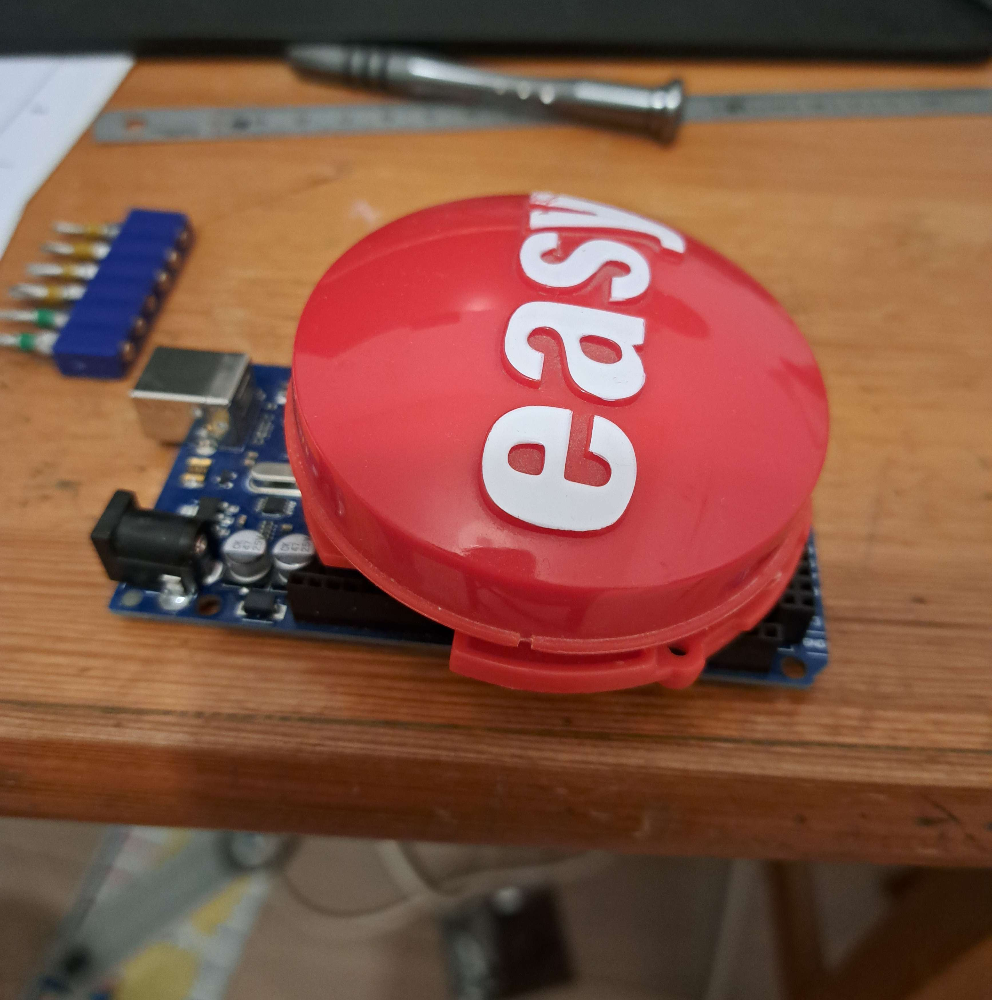

# button
<p>Converting a toy button into a macro keyboard.</p>


<p>Working over serial, a python app receives clicks and executes actions.</p>


```
Attention a bien modifier la librairie pynput en fonction de la plateforme de destination.
fichier : pynput/keyboard/__init__.py
modification (linux) (pour windows _win32 au lieu de xorg) :

import pynput.keyboard._xorg as _xorg

#backend = backend(__name__)
backend = _xorg
```